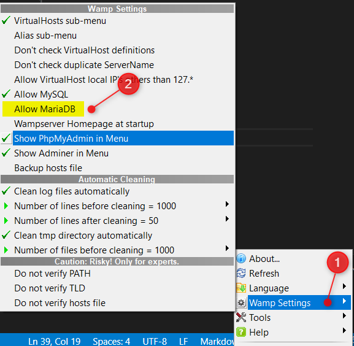
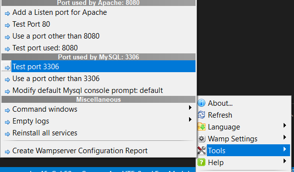

# Disable MariaDB

Right-click on the Wamp icon in the tray-panel, select `Wamp settings` then uncheck `Allow MariaDB`.

Attention: make sure to configure MySQL to use port `3306`. Right-click on the Wamp icon in the tray-panel, select `Tools` and update the port if needed.

