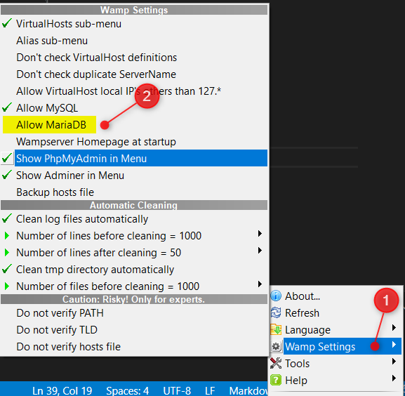
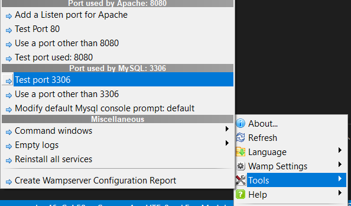

# Wamp tips

> Some tips &amp; tricks for wamp

[http://www.wampserver.com/](http://www.wampserver.com/)

* [Newer version of PHP](#newer-version-of-php)
* [Create a new host](#create-a-new-host)
* [Disable MariaDB](#disable-mariadb)
* [Troubleshootings](#troubleshootings)
  * [Incorrect port for MySQL](#incorrect-port-for-mysql)

## Newer version of PHP

First, you need to know if you've a `Thread Safety` version of not.

1. Open your local website [http://localhost:8080?phpinfo=1](http://localhost:8080?phpinfo=1) and search for `Thread Safety`, check if the value is `enabled` or not.
2. Go to [https://windows.php.net/download](https://windows.php.net/download) and download your version, take a `Thread Safe 64x` version if `Thread Safety` was enabled.
3. Unzip the file in your `c:\wamp64\bin\php` folder and create a folder for the PHP version (f.i. `c:\wamp64\bin\php\php7.4.4` *we'll use that name for the next steps*).
4. Copy the `wampserver.conf` file from a previous folder; f.i. copy  `c:\wamp64\bin\php\php7.4.0\wampserver.conf` to `c:\wamp64\bin\php\php7.4.4\wampserver.conf`.
5. Duplicate the `c:\wamp64\bin\php\php7.4.4\php.ini-development` file and create `c:\wamp64\bin\php\php7.4.4\php.ini`
6. Edit `c:\wamp64\bin\php\php7.4.4\php.ini` and update values for the following variables; make sure the value is a valid path on your system (make sure to use the Unix directory separator `/`)
   1. `error_log` = "C:/wamp64/logs/php_error.log"
   2. `extension_dir` = "C:/wamp64/bin/php/php7.4.4/ext/"
   3. `upload_tmp_dir` = "C:/wamp64/tmp"
   4. `session.save_path` = "C:/wamp64/tmp"
   5. `soap.wsdl_cache_dir` = "C:/wamp64/tmp"
7. Duplicate the `c:\wamp64\bin\php\php7.4.4\php.ini` file and create `c:\wamp64\bin\php\php7.4.4\phpForApache.ini`

Note: `php.ini` is used by DOS and `phpForApache.ini` is used by Apache i.e. when running a web page.

Note: also make sure to edit your Windows Environment Variables here and there to replace any links to the old PHP version to use the newer one (so replace f.i. any links to PHP 7.3.x to the installed version of PHP).

## Create a new host

Just go to the `C:\wamp64\alias` folder, duplicate an existing `.conf` file and edit the file. 

Change the alias name and the path (make sure to use the Unix syntax).

Restart the Wamp server.

## Disable MariaDB

Right-click on the Wamp icon in the traypanel, select `Wamp settings` then uncheck `Allow MariaDB`.



Attention: make sure to configure MySQL to use port `3306`. Right-click on the Wamp icon in the traypanel, select `Tools` and update the port if needed.



## Troubleshootings

### Incorrect port for MySQL

The error below happens when the MySQL service isn't started or when the php script is using a specific port (probably `3306`) and wamp is configured to use another one (f.i. `3308`).

```bash
ERROR: SQLSTATE[HY000] [2002] No connection could be made because the target machine actively refused it
```

To solve it, right-click on the Wamp icon in the traypanel, select `Tools` and update the port if needed.


